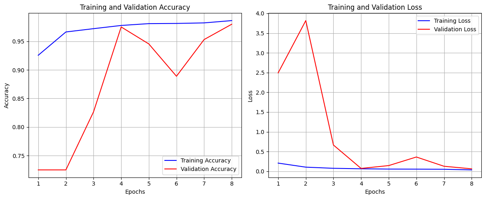
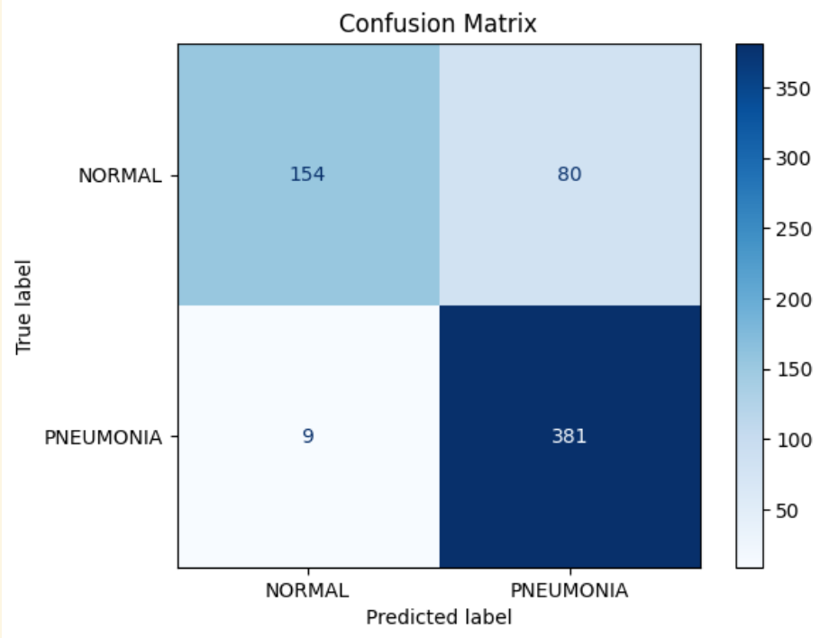

# Transfer-Learning
In this repo we are going to try transfer learning:

- Get to know the data set(*chest_xray*)
- Build, train and evaluate a Vanilla CNN
<p align="center">
    
</p>

- Download a pretrained model(*ResNet152V2*), and train it for our case. 
<p align="center">
    
</p>

- And finally, fine-tune the pretrained model.
```markdown
20/20 [==============================] - 61s 3s/step - loss: 1.2915 - accuracy: 0.8013
```


